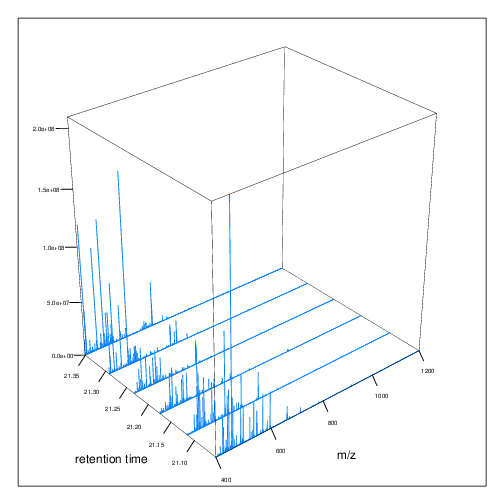
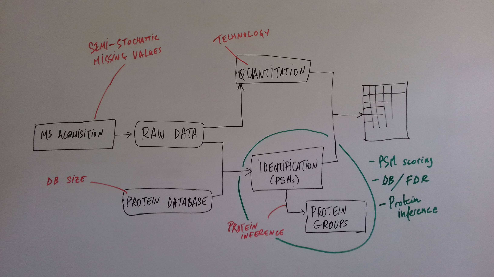

class: middle
name: cc-by

### Get the slides at http://bit.ly/20180712csama

These slides are available under a **creative common
[CC-BY license](http://creativecommons.org/licenses/by/4.0/)**. You are
free to share (copy and redistribute the material in any medium or
format) and adapt (remix, transform, and build upon the material) for
any purpose, even commercially
.


---
class: middle center


???

From a 2011 study that compared the expression profiles of 3 cell
lines using RNA-Seq, MS-based proteomics and immunofluorescence
(protein-specific antibodies).

They observed an overall Spearman correlation of 0.63.

**In what ways to these summaries differ?**

Using a common gene-centric identifier, but

- What do we have along the rows, what are our features? Transcripts
  on the left. Protein groups on the right.
- How are these intensities produced?

## Take-home message 1

These data tables are less similar than they appear.

---
class: middle

### Overview


---
class: middle

### Overview


---
### How does MS work?

1. Digestion of proteins into peptides - as will become clear later,
   the features we measure in shotgun (or bottom-up) *proteomics* are
   peptides, **not** proteins.

--

2. On-line liquid chromatography (LC-MS)

--

3. Mass spectrometry (MS) is a technology that **separates** charged
   molecules (ions, peptides) based on their mass to charge ratio
   (M/Z).

---
### Chromatography

MS is generally coupled to chromatography (liquid LC, but can also be
gas-based GC). The time an analytes takes to elute from the
chromatography column is the **retention time**.


???

- This is an acquisition. There can be one per sample (with muliple
  fractions), of samples can be combined/multiplexed and acquired
  together.

---
class: middle

An mass spectrometer is composed of three components:

1. The *source*, that ionises the molecules: examples are Matrix-assisted
   laser desorption/ionisation (MALDI) or electrospray ionisation
   (ESI).
2. The *analyser*, that separates the ions: Time of flight (TOF) or Orbitrap.
3. The *detector* that quantifies the ions.

Ions typically go through that cylce at least twice (MS2, tandem MS,
or MSMS). Before the second cycle, individual *precursor* ions a
selected and broken into *fragment* ions.

---
class: middle center


???

Before MS:
- Restriction with enzyme, typically trypsine.
- Off-line fractionation.

An mass spectrometer is composed of three components:

1. The *source*, that ionises the molecules: examples are Matrix-assisted
   laser desorption/ionisation (MALDI) or electrospray ionisation
   (ESI).
2. The *analyser*, that separates the ions: Time of flight (TOF) or Orbitrap.
3. The *detector* that quantifies the ions.

Ions typically go through that cylce at least twice (MS2, tandem MS or
MSMS). Before the second cycle, individual *precursor* ions a
selected, broken into fragment ions.

---
class: middle center


---
class: middle center


???

Highlight
- Semi-stochastic nature of MS
- Data dependent acquisition (DDA)

---
class: middle center

.left-col-50[

]

.right-col-50[

]

???

- Please keep this MS space and the semi-stochastic nature of MS
  acquisition in mind , as I will come back to it later.


---
###  Identification: fragment ions


---
###  Identification: Peptide-spectrum matching (PSM)

Matching **expected** and *observed* spectra:

```
> MSnbase::calculateFragments("SIGFEGDSIGR")
           mz  ion type pos z        seq
1    88.03931   b1    b   1 1          S
2   201.12337   b2    b   2 1         SI
3   258.14483   b3    b   3 1        SIG
4   405.21324   b4    b   4 1       SIGF
5   534.25583   b5    b   5 1      SIGFE
6   591.27729   b6    b   6 1     SIGFEG
7   706.30423   b7    b   7 1    SIGFEGD
8   793.33626   b8    b   8 1   SIGFEGDS
9   906.42032   b9    b   9 1  SIGFEGDSI
10  963.44178  b10    b  10 1 SIGFEGDSIG
11  175.11895   y1    y   1 1          R
12  232.14041   y2    y   2 1         GR
13  345.22447   y3    y   3 1        IGR
14  432.25650   y4    y   4 1       SIGR
15  547.28344   y5    y   5 1      DSIGR
16  604.30490   y6    y   6 1     GDSIGR
 [ reached getOption("max.print") -- omitted 16 rows ]
```

---
class: middle

###  Identification: Peptide-spectrum matching (PSM)

Matching *expected* and **observed** spectra:


???

Performed by **search engines** such as Mascot, MSGF+, Andromeda, ...

---
### Identification: database


???

## [Human proteome](https://www.uniprot.org/help/human_proteome)

In 2008, a draft of the complete human proteome was released from
UniProtKB/Swiss-Prot: the approximately 20,000 putative human
protein-coding genes were represented by one UniProtKB/Swiss-Prot
entry, tagged with the keyword 'Complete proteome' and later linked to
proteome identifier UP000005640. This UniProtKB/Swiss-Prot H. sapiens
proteome (manually reviewed) can be considered as complete in the
sense that it contains one representative (**canonical**) sequence for
each currently known human gene. Close to 40% of these 20,000 entries
contain manually annotated alternative isoforms representing over
22,000 additional sequences


## [What is the canonical sequence?](https://www.uniprot.org/help/canonical_and_isoforms)

To reduce redundancy, the UniProtKB/Swiss-Prot policy is to describe
all the protein products encoded by one gene in a given species in a
single entry. We choose for each entry a canonical sequence based on
at least one of the following criteria:

1. It is the most prevalent.
2. It is the most similar to orthologous sequences found in other species.
3. By virtue of its length or amino acid composition, it allows the
   clearest description of domains, isoforms, polymorphisms,
   post-translational modifications, etc.
4. In the absence of any information, we choose the longest sequence.


## Are all isoforms described in one UniProtKB/Swiss-Prot entry?

Whenever possible, all the protein products encoded by one gene in a
given species are described in a single UniProtKB/Swiss-Prot entry,
including isoforms generated by alternative splicing, alternative
promoter usage, and alternative translation initiation (*). However,
some alternative splicing isoforms derived from the same gene share
only a few exons, if any at all, the same for some 'trans-splicing'
events. In these cases, the divergence is obviously too important to
merge all protein sequences into a single entry and the isoforms have
to be described in separate 'external' entries.

## UniProt [downloads](https://www.uniprot.org/downloads)

---
class: middle

### Identification


From Käll *et al.* [Posterior Error Probabilities and False Discovery
Rates: Two Sides of the Same Coin](https://pubs.acs.org/doi/abs/10.1021/pr700739d).

???


- (global) FDR = B/(A+B)
- (local) fdr = PEP = b/(a+b)


---
###  Identification: Protein inference

- Keep only reliable peptides
- From these peptides, infer proteins
- If proteins can't be resolved due to shared peptides, merge them
  into **protein groups** of indistinguishable or non-differentiable
  proteins.


---
class: middle


From [Qeli and Ahrens
(2010)](http://www.ncbi.nlm.nih.gov/pubmed/20622826).


---
class: middle


From [Nesvizhskii and Aebersold
(2005)](http://www.ncbi.nlm.nih.gov/pubmed/16009968).

???

Basic peptide grouping scenarios.
- a. distinct protein identifications.
- b. differentiable protein identifications.
- c. indistinguishable protein identifications.
- d. subset protein identification.
- e. subsumable protein identification.
- f. an example of a protein group where one protein can explain all
  observed peptides, but its identification is not conclusive.

---
class: middle

### Quantitation


|    |Label-free |Labelled   |
|:---|:----------|:----------|
|MS1 |XIC        |SILAC, 15N |
|MS2 |Counting   |iTRAQ, TMT |

---
class: middle center

### Label-free MS2: Spectral counting


From the [Pbase](https://bioconductor.org/packages/release/bioc/html/Pbase.html) package.


???

Comments of **spectral counting**:
- easy, but *semi-quantitative*
- **Note depth/coverage* and compare to RNA-seq.**

---
class: middle center

### Labelled MS2: Isobaric tagging


???

Comments of **isobaric tagging**:
- multiplexing, albeit limited
- limited problem with missing values
- easy to process (fewer parameters to set)

---
class: middle center

### Label-free MS1: extracted ion chromatograms


Credit: [Johannes Rainer](https://github.com/jotsetung/)

???

Comments on **label-free**:

- Data processing
- Independent runs, NAs

---
class: middle center

### Labelled MS1: SILAC


Credit: Wikimedia Commons.

???

Comments of **isotope labelling**:
- like red/green microarrays
- can be extended to 3, but risk of overlap of light, medium and heavy
  peaks

---
class: middle

### Quantitation


|    |Label-free |Labelled   |
|:---|:----------|:----------|
|MS1 |XIC        |SILAC, 15N |
|MS2 |Counting   |iTRAQ, TMT |

- Labelled methods allow to pool samples before MS acquisition (up to
  10 samples for Tandem Mass Tags (TMT)), rather than running
  individual MS runs for each samples, and thus sharing technical
  variability and reducing missing data (see for example Russel and
  Lilley [Pipeline to assess the greatest source of technical variance
  in quantitative proteomics using metabolic
  labelling](https://www.sciencedirect.com/science/article/pii/S1874391912006641)).

- Summarising spectrum/peptide intensities into the protein (group)
  level quantities.

???

- Isobaric tagging (TMT, iTRAQ) are combined at the peptide level,
  i.e. after labelling.

- Metabolic labelling (SILAC, 15N, 18O) are combined at the protein
  level, thus sharing some additional technical variability.

---
class: middle
### Dealing with missing values

Really missing, or not detected (semi-stochastic nature of precursor
selection in shotgun proteomics)?

- Identifiction transfer/matching between runs.
- Filtering.
- Imputation.


---
class: middle


.left-col-50[

]

.right-col-50[

]

.left-col-100[
From Bond *et al.* [Improving Qualitative and Quantitative Performance
for MSE-based Label-free
Proteomics](https://pubs.acs.org/doi/10.1021/pr300776t).
]


---
### Missing values

- Filtering.
- Imputation: considering the underlying nature of missingness, i.e
  missing not at random (left-censored) or at random.


Lazar *et al.* [Accounting for the Multiple Natures of Missing Values
in Label-Free Quantitative Proteomics Data Sets to Compare Imputation
Strategies](http://dx.doi.org/10.1021/acs.jproteome.5b00981).


???

Root-mean-square error (RMSE) observations standard deviation ratio
(RSR), KNN and MinDet imputation. Lower (blue) is better.


---
class: middle

### Recap


???

What we have seen so far.

---
class: middle

### Challenges


???

Turning the many buttons independently.

---
class: middle

### Challenges



???

Turning the many buttons independently.

---
class: middle
### Challenges


???

Turning the many buttons independently.

---
class: middle

### Challenges


???

- These different parts aren't independent
- Linking results to raw and identification data.

## Examples

- Is it better to quantify everything and search for differentially
  expressed features (even if not identified) and pay a heavy code for
  my p-value adjustment, or am I better off applying a stringent
  filter at the identification level to limit the number of tests?

- Wouldn't it be better to focus on peptide-level data analysis and
  avoid the protein inference problem, rather than work with
  protein-level summaries?

## Take-home message 2:

How could we control the whole process, and directly account for the
dependency of these different parts of a typical proteomcis pipeline?

---

### Bioconductor software infrastructure

.left-col-75[
#### Raw data: `mzML`

`MSnbase::readMSData` to read raw data into R as `MSnExp`.

#### Identification data: `mzid`

`MSnbase::readMzIdData` as a `data.frame`.

#### Quantitative data

`MSnbase::readMSData2` as an `MSnSet`.
]

.right-col-25[


]


???

What are we going to see in the
[lab](https://rawgit.com/lgatto/bioc-ms-prot/master/lab.html) this
afternoon

- I'll start with a refreshed of what I have presented now
- An overview of packages and functionality available in various
  R/Bioc packages
- Where to find data
- Existing infrastructure for raw, id and quant data
- Some routes of general data analysis, such as differential analysis,
  classification, dimensinality reduction, ... as seen during other
  lectures.

Also mention the **on-line** tag.

---
class: middle

### Other technologies: DIA

Data Independent Acquisition (DIA) (as opposed to Data Dependent
Acquisition - DDA).

Examples:

- $MS^{E}$, where the whole M/Z range is fragmented (at different
  energies) and precursors and fragment ions are matched using their
  elution profiles, by Waters.
- SWATH-MS (Sequential Windowed Acquisition of All Theoretical
  Fragment Ion Mass Spectra) by AB Sciex
- AIF (All-ion fragmentation, similar to $MS^E$) by Thermo Fisher.
- ...

The advantage of these DIA methods is that all the data are recorded;
they have the potential to analyse all the data, thus limiting the
number of missing values.

See Law and Lim [Recent advances in mass spectrometry: data
independent analysis and hyper reaction
monitoring](https://www.tandfonline.com/doi/full/10.1586/14789450.2013.858022).

???

- DIA methods are maturing, but arguably not as widely applied as
  DDA. They also require specific software (commercial solution, PLGS
  for MSe) that is arguably not the very best one can hope for.

- SWATH-MS acquisition uses pre-defined real spectra libraries
  libraries and also requires dedicated software (OpenSWATH, a open
  and good software). SWATH-MS is also considered having high
  throughout as well as reproducibility and consistency (in the hands
  of experts).

---
class: middle

### Other technologies: targeted proteomics

Selected/multiple/parallel reaction monitoring (SRMs, MRM, PRM) are
pre-defined MS features that the instrument will specifically scan
for. This is the method to assay a limited number of peptides/proteins
in a high number of samples.

---
class: middle

### Other technologies: single cell proteomics using CyTOF

In **mass cytometry**, rare earth metals are used as reporters on
antibodies. Analysis of metal abundances using the mass cytometer
allows determination of the expression of 100s of markers in 1000s
individual cells.

See Giesen *et al.* [Highly multiplexed imaging of tumor tissues with
subcellular resolution by mass
cytometry](https://www.nature.com/articles/nmeth.2869) and Bendall *et
al.* [Single-Cell Mass Cytometry of Differential Immune and Drug
Responses Across a Human Hematopoietic
Continuum](http://science.sciencemag.org/content/332/6030/687.full).


---
class: middle

### Other technologies: single cell proteomics using MS

Single Cell ProtEomics by Mass Spectrometry (SCoPE-MS) can quantify
thousands of proteins in single mammalian cells.


Budnik *et al.* [Mass-spectrometry of single mammalian cells
quantifies proteome heterogeneity during cell
differentiation](https://www.biorxiv.org/content/early/2018/01/01/102681).

See also Zhu *et al.* [Nanodroplet processing platform for deep and
quantitative proteome profiling of 10–100 mammalian
cells](https://www.nature.com/articles/s41467-018-03367-w).

???

A major issue in MS-based proteomics is dynamic range (up to $10^9$),
and proteins of very low abundance are always hard to
quantify. (Reminder: there is no PCR equivalent for oligopeptides)

The difficulty to measure low abundance proteins becomes even more
accute when low amounts of biological material are used, in particular
single cells.

---
class: middle

### Additional dimensions

- Post-translational modifications (PTMs)
- Protein-protein interactions (PPI)
- Protein sub-cellular localisation (spatial proteomics)

When based on MS, all points discussed above will remain relevant.

???

- There are additional dimensions to the study of proteins, such as
  ....
- When based on MS, all points discussed above will be relevant too.

---
class: middle
name: laurent-gatto

.left-col-50[

### Laurent Gatto

<i class="fas fa-map-marker-alt"></i>&nbsp;University of Cambridge<br />
<i class="fas fa-map-marker-alt"></i>&nbsp;[de Duve Institute](http://www.deduveinstitute.be/), UCLouvain<br />
<br />
<i class="fas fa-home"></i>&nbsp;https://lgatto.github.io<br />
<i class="fab fa-twitter"></i>&nbsp;[@lgatto](https://twitter.com/lgatt0/)<br />
<i class="fab fa-github"></i>&nbsp;[lgatto](https://github.com/lgatto/)<br />
&nbsp;[0000-0002-1520-2268](https://orcid.org/0000-0002-1520-2268)<br />
&nbsp;[lgatto](https://keybase.io/lgatto)<br />
&nbsp;[Google scholar](https://scholar.google.co.uk/citations?user=k5DrB74AAAAJ&hl=en)<br />
&nbsp;[Impact story](https://profiles.impactstory.org/u/0000-0002-1520-2268)<br />
<i class="fas fa-pencil-alt"></i>&nbsp;[dissem.in](https://dissem.in/r/6231/laurent-gatto)<br />
<!-- <i class="fab fa-linkedin"></i>&nbsp;https://www.linkedin.com/in/lgatto/<br /> -->
]

.rigth-col-50[

**Acknowledgements**: [BBSRC](http://www.bbsrc.ac.uk/) and the
[Wellcome Trust](https://wellcome.ac.uk/) and
collaborators/contributors [Lisa
Breckels](https://github.com/lmsimp/), [Olly
Crook](https://olivercrook.co.uk/), [Sebastian
Gibb](https://sgibb.github.io/) and [Johannes
Rainer](https://github.com/jotsetung/).

**New positions available** at the de Duve Institute, in Brussels.

## Thank you for your attention

### Find the slides at [http://bit.ly/20180712csama](http://bit.ly/20180712csama)
]
